# 3X-UI 完整安装指南

## 目录

- [前言](#前言)
- [系统要求](#系统要求)
- [第一部分：服务器准备](#第一部分服务器准备)
- [第二部分：安装3X-UI](#第二部分安装3x-ui)
- [第三部分：安装宝塔面板](#第三部分安装宝塔面板)
- [第四部分：宝塔面板配置SSL](#第四部分宝塔面板配置ssl)
- [第五部分：3X-UI面板设置](#第五部分3x-ui面板设置)
- [第六部分：创建节点](#第六部分创建节点)
- [第七部分：客户端配置](#第七部分客户端配置)
- [常见问题解答](#常见问题解答)
- [性能优化](#性能优化)
- [安全加固](#安全加固)
- [维护与备份](#维护与备份)
- [附录：Docker安装方式](#附录docker安装方式)

## 前言

本教程将详细介绍如何在Linux系统上安装3X-UI代理面板，并配合宝塔面板实现安全的HTTPS访问。我们提供了完整的步骤说明，确保即使是新手也能顺利完成部署。

> **注意**：本教程仅供个人学习和技术研究使用，请遵守当地法律法规。

## 系统要求

- **操作系统**：推荐 Debian 11+ / Ubuntu 20.04+ / CentOS 8+
- **内存**：至少 1GB RAM（推荐 2GB 以上）
- **存储**：至少 10GB 可用空间
- **网络**：公网IP（用于申请SSL证书）
- **域名**：一个已解析到服务器IP的域名（用于配置SSL）

## 第一部分：服务器准备

### 1.1 更新系统并安装基础组件

```bash
# Debian/Ubuntu系统
apt update -y
apt upgrade -y
apt install -y curl wget sudo socat unzip tar

# CentOS系统
yum update -y
yum install -y curl wget sudo socat unzip tar
```

### 1.2 配置防火墙

```bash
# 开放必要端口
# 宝塔面板需要的端口
ufw allow 8888,20,21,22,80,443/tcp

# 或者如果您使用的是firewalld
firewall-cmd --permanent --zone=public --add-port=8888/tcp
firewall-cmd --permanent --zone=public --add-port=20-22/tcp
firewall-cmd --permanent --zone=public --add-port=80/tcp
firewall-cmd --permanent --zone=public --add-port=443/tcp
firewall-cmd --reload
```

### 1.3 确认域名解析

在继续之前，请确保您的域名已正确解析到服务器IP地址。可以通过以下命令检查：

```bash
ping 您的域名
```

应该看到返回的IP地址与您服务器的公网IP一致。

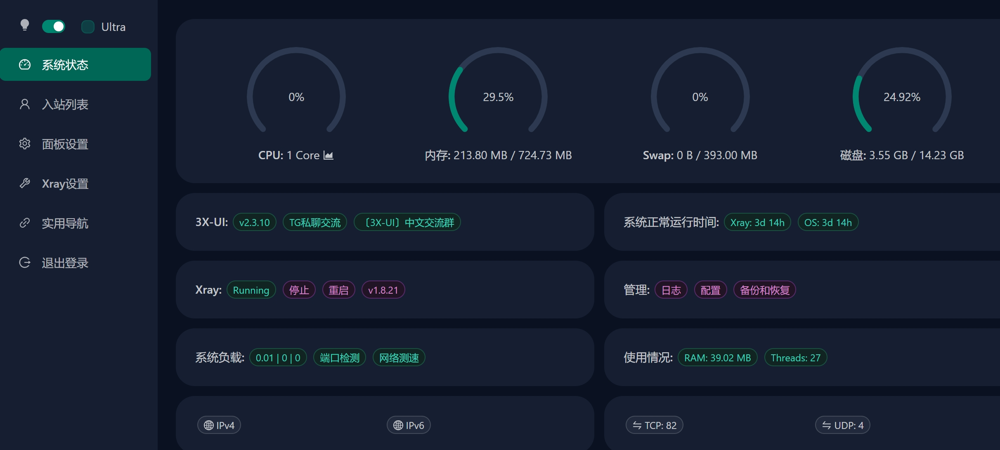

## 第二部分：安装3X-UI

### 2.1 通过一键脚本安装3X-UI

```bash
bash <(curl -Ls https://raw.githubusercontent.com/xeefei/3x-ui/master/install.sh)
```

安装过程中会询问以下信息：

- **用户名**：建议使用随机生成或自定义（不要使用默认值）
- **密码**：建议使用强密码
- **面板端口**：可以使用默认的2053，或自定义（建议使用10000-65535之间的端口）
- **面板访问路径**：建议自定义，增加安全性

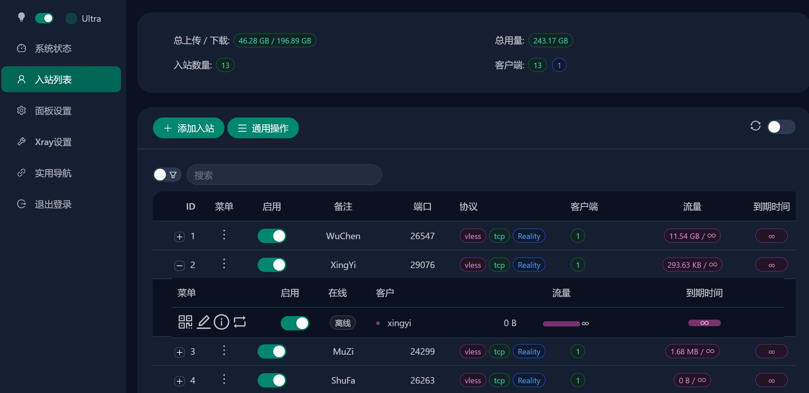

安装完成后，会显示以下信息：
- 登录用户名
- 登录密码
- 登录端口
- 访问路径

请务必保存这些信息，它们是登录3X-UI面板的凭据。

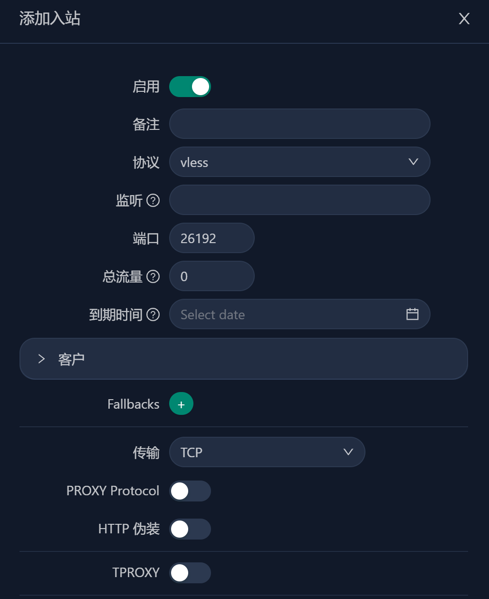

### 2.2 放行3X-UI端口

使用以下命令放行3X-UI面板的端口：

```bash
# 进入3X-UI管理界面
x-ui
```

选择选项"22"（防火墙放行端口），然后输入您的3X-UI面板端口（默认2053）。

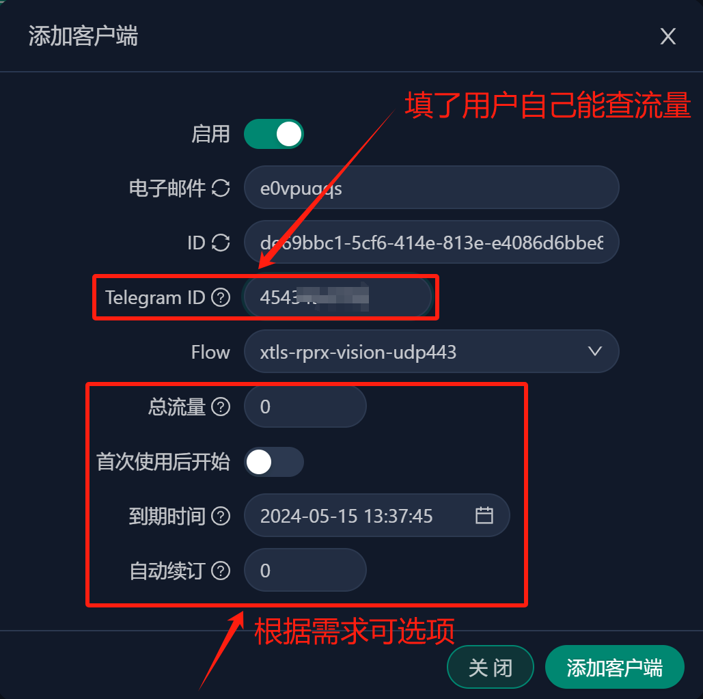

## 第三部分：安装宝塔面板

### 3.1 下载并安装宝塔面板

```bash
# Debian/Ubuntu系统
wget -O install.sh http://download.bt.cn/install/install-ubuntu_6.0.sh && bash install.sh

# CentOS系统
yum install -y wget && wget -O install.sh http://download.bt.cn/install/install_6.0.sh && sh install.sh
```

安装过程中会提示您设置宝塔面板的登录信息，请记住显示的用户名、密码和面板访问地址。

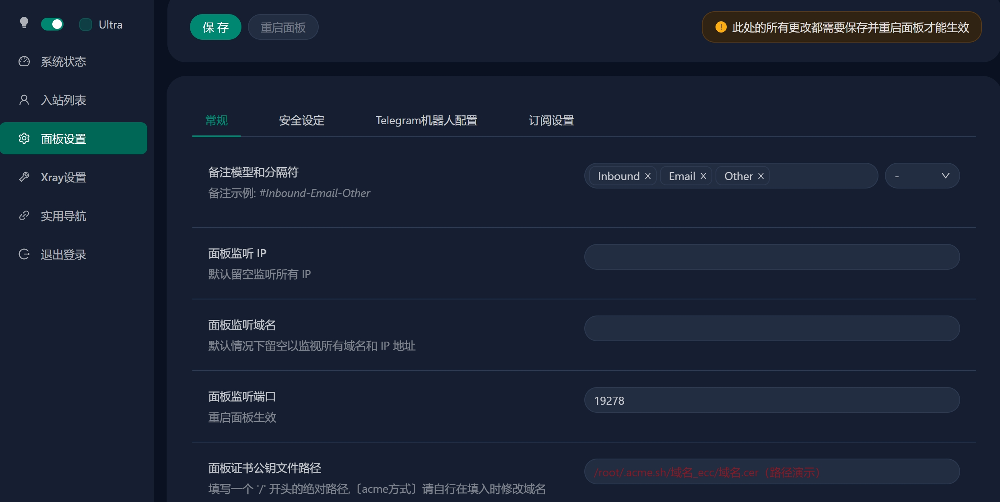

### 3.2 登录宝塔面板

使用浏览器访问安装完成后显示的面板地址（通常是 `http://您的IP:8888/` 或 `http://您的域名:8888/`），输入用户名和密码登录。

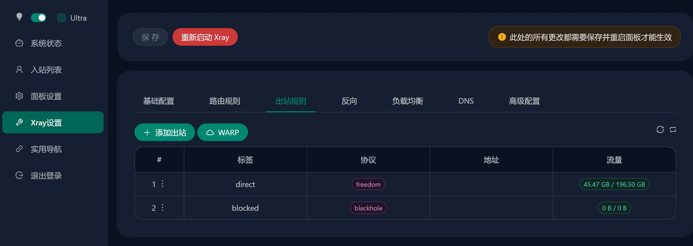

### 3.3 安装LNMP环境

1. 登录面板后，会提示您安装运行环境，建议选择"LNMP"模式。
2. 软件推荐版本：
   - Nginx: 最新稳定版
   - MySQL: 5.7 或 8.0
   - PHP: 7.4
   - Pure-Ftpd: 勾选
   - phpMyAdmin: 勾选

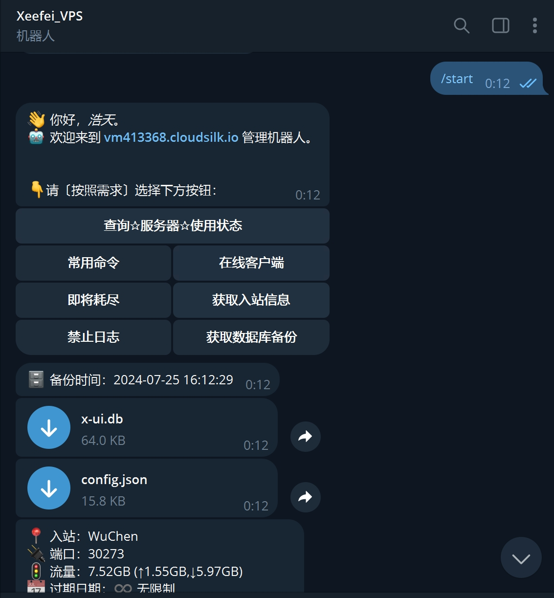

3. 点击"一键安装"，等待安装完成（可能需要5-30分钟，取决于服务器配置和网络环境）。

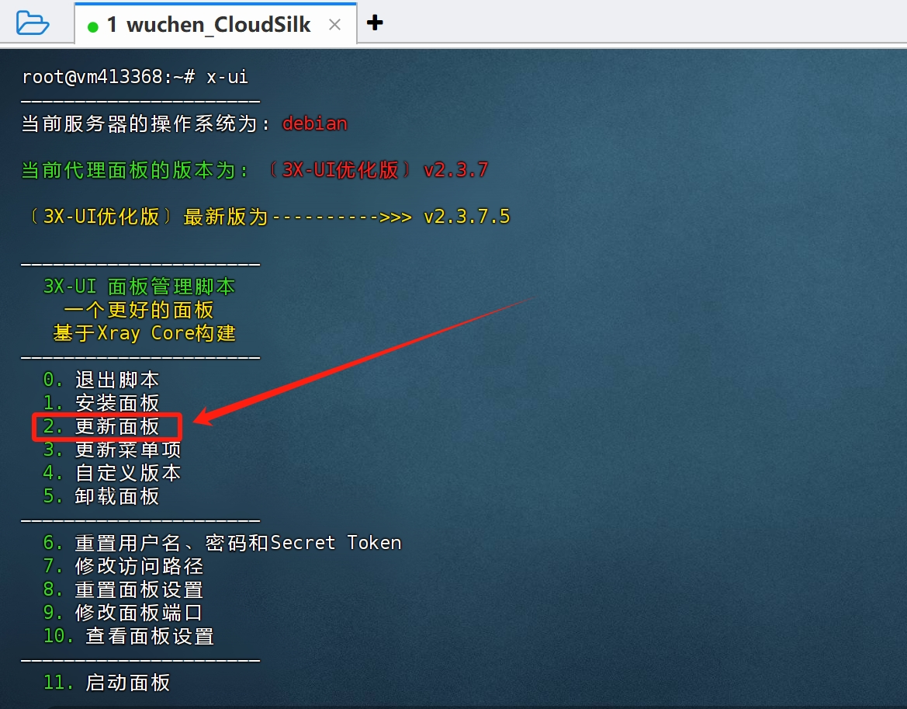

## 第四部分：宝塔面板配置SSL

### 4.1 创建网站

1. 登录宝塔面板
2. 点击左侧菜单"网站"
3. 点击"添加站点"
4. 填写以下信息：
   - 域名：填写您的域名
   - 备注：可选，例如"3X-UI面板"
   - 根目录：保持默认
   - FTP：不创建
   - 数据库：不创建
   - PHP版本：纯静态
5. 点击"提交"

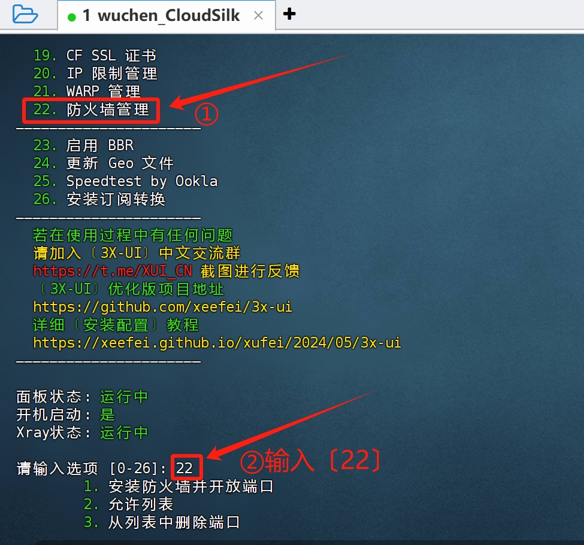

### 4.2 申请SSL证书

1. 在网站列表中找到您刚创建的网站
2. 点击"设置"
3. 点击"SSL"选项卡
4. 选择"Let's Encrypt"
5. 勾选"强制HTTPS"
6. 点击"申请"
7. 等待证书申请完成

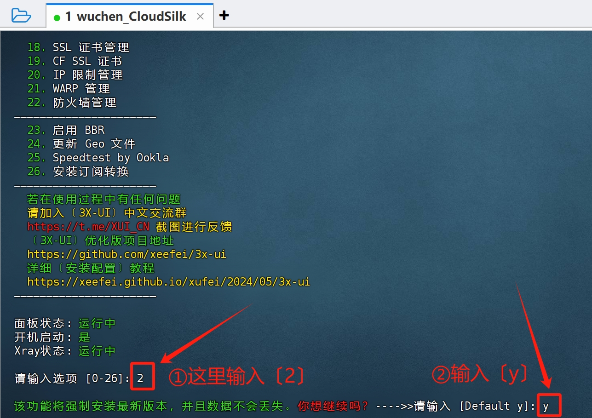

### 4.3 配置反向代理

1. 在网站设置中点击"反向代理"选项卡
2. 点击"添加反向代理"
3. 填写以下信息：
   - 代理名称：3X-UI
   - 目标URL：`http://127.0.0.1:2053`（或您设置的自定义端口）
   - 发送域名：$host
4. 点击"提交"

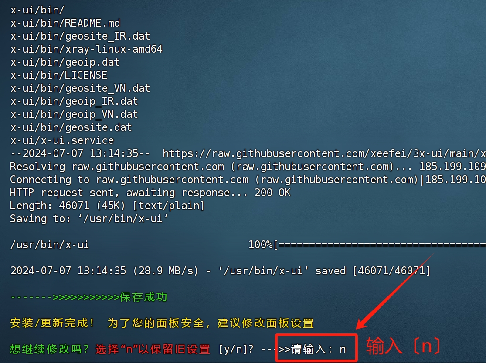

### 4.4 优化反向代理配置

1. 在网站列表中找到您的网站
2. 点击"配置文件"
3. 找到包含`proxy_pass`的location块，在其中添加以下配置：

```nginx
proxy_set_header X-Forwarded-For $proxy_add_x_forwarded_for;
proxy_set_header X-Forwarded-Proto $scheme;
proxy_set_header X-Forwarded-Host $http_host;
proxy_http_version 1.1;
proxy_set_header Upgrade $http_upgrade;
proxy_set_header Connection "upgrade";
```

4. 点击"保存"
5. 点击"重启Nginx"使配置生效

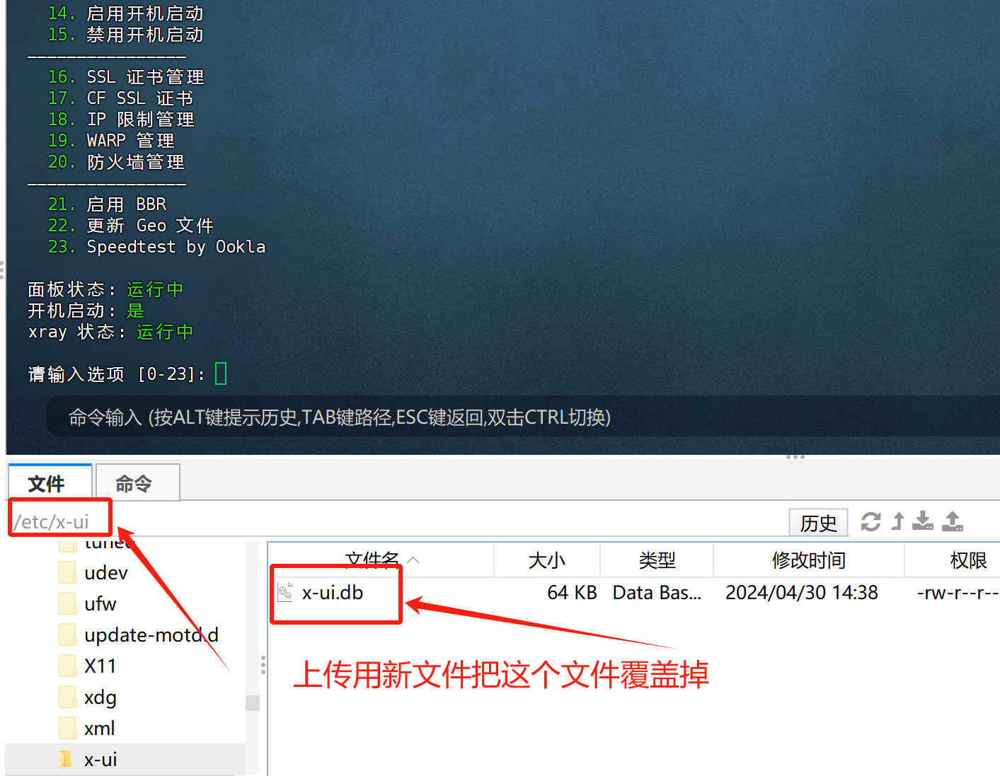

## 第五部分：3X-UI面板设置

### 5.1 访问3X-UI面板

通过您的域名访问3X-UI面板：`https://您的域名/您设置的路径/panel`

例如，如果您的域名是example.com，路径是admin，那么访问地址就是：`https://example.com/admin/panel`

输入安装时设置的用户名和密码登录。

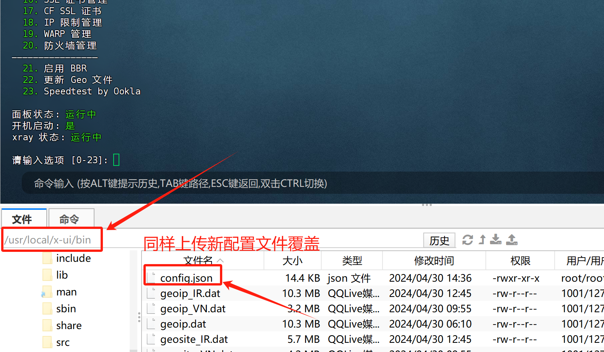

### 5.2 设置面板语言

1. 登录后，点击右上角的设置按钮
2. 在语言下拉菜单中选择"简体中文"
3. 点击应用

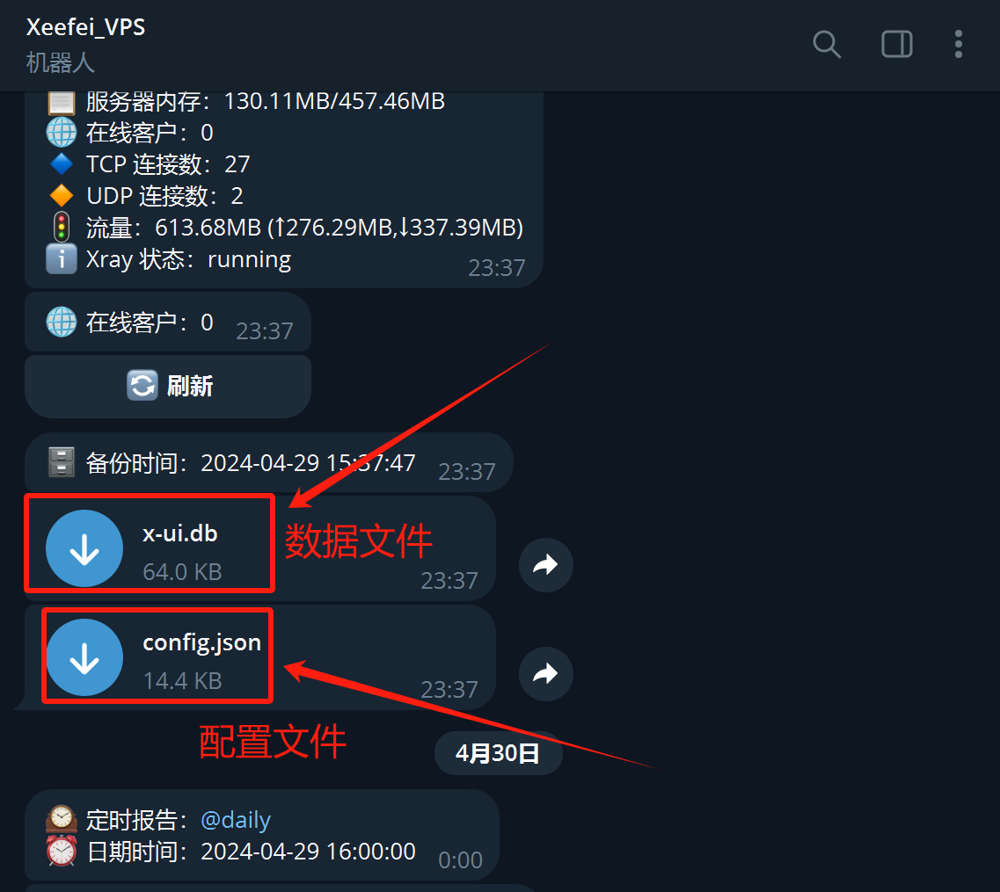

### 5.3 面板安全设置

1. 点击左侧菜单"面板设置"
2. 在"常规"选项卡中，可以修改以下设置：
   - 面板监听IP
   - 面板端口
   - 面板路径
   - 用户名
   - 密码

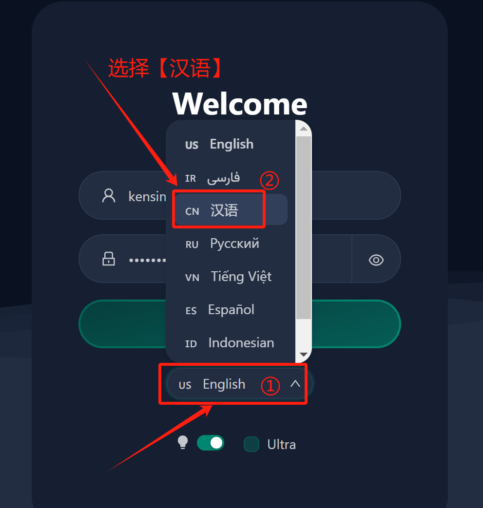

### 5.4 配置电报机器人（可选）

1. 在"面板设置"中点击"机器人配置"
2. 按照界面提示设置电报机器人参数
3. 完成后点击保存并重启面板

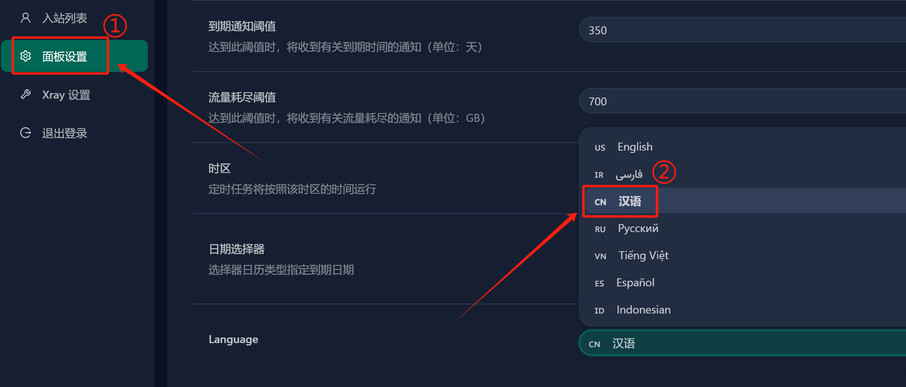

## 第六部分：创建节点

### 6.1 添加入站

1. 点击左侧菜单"入站列表"
2. 点击"添加入站"
3. 填写以下信息：
   - 备注：为节点添加描述
   - 协议：选择VLESS、VMess、Trojan等
   - 传输：推荐TCP或WebSocket
   - 端口：选择一个未被占用的端口（建议10000以上）

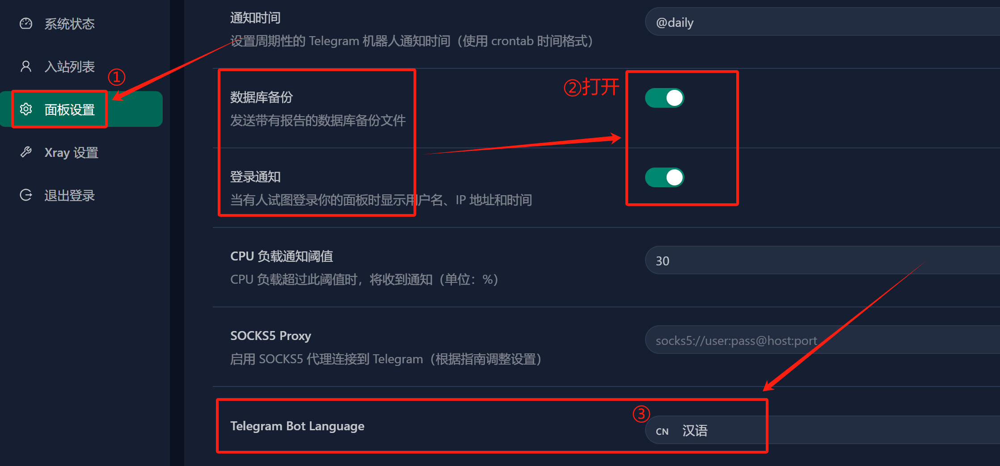

### 6.2 配置REALITY（推荐）

如果选择使用VLESS+REALITY+Vision组合：
1. 在添加入站时选择VLESS协议
2. 传输方式选择TCP
3. TLS设置中选择REALITY
4. 目标网站填写您想伪装的网站域名
5. 点击"Get New Cert"获取新的私钥和公钥

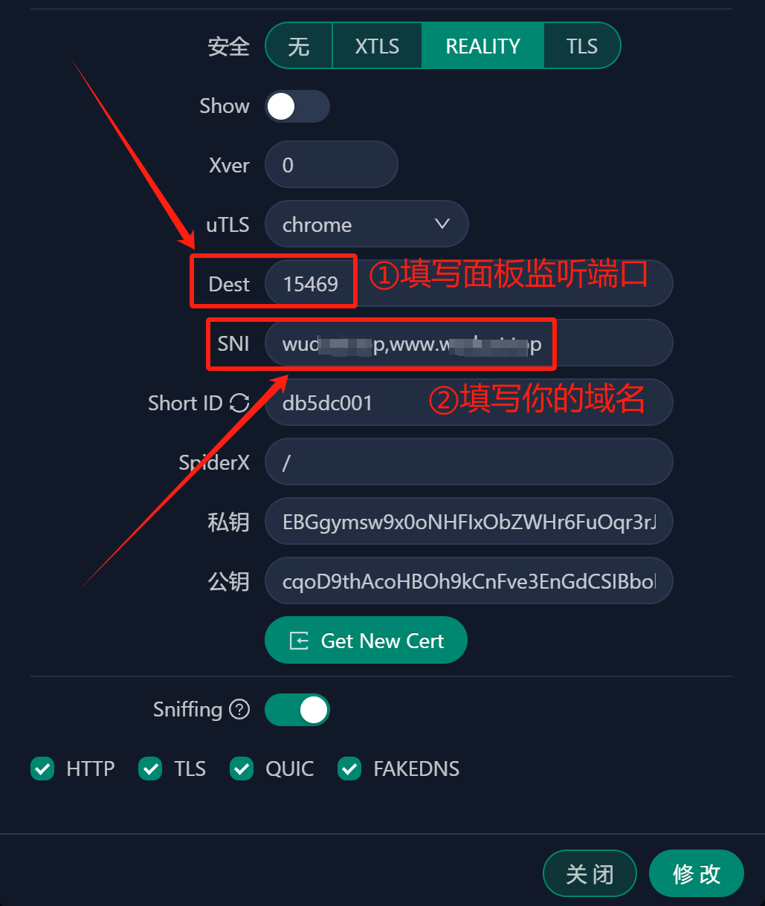

以下是推荐的配置模板：

```json
{
  "log": {
    "access": "./access.log",
    "error": "./error.log",
    "loglevel": "warning"
  },
  "inbounds": [
    {
      "port": 10086,
      "protocol": "vless",
      "settings": {
        "clients": [
          {
            "id": "UUID将由面板自动生成",
            "flow": "xtls-rprx-vision"
          }
        ],
        "decryption": "none"
      },
      "streamSettings": {
        "network": "tcp",
        "security": "reality",
        "realitySettings": {
          "show": false,
          "dest": "www.microsoft.com:443",
          "xver": 0,
          "serverNames": [
            "www.microsoft.com",
            "www.microsoft.cn",
            "www.bing.com"
          ],
          "privateKey": "私钥将由面板自动生成",
          "minClientVer": "",
          "maxClientVer": "",
          "maxTimeDiff": 0,
          "shortIds": [
            "",
            "0123456789abcdef"
          ]
        }
      },
      "sniffing": {
        "enabled": true,
        "destOverride": [
          "http",
          "tls",
          "quic"
        ]
      }
    }
  ],
  "outbounds": [
    {
      "protocol": "freedom",
      "settings": {}
    },
    {
      "protocol": "blackhole",
      "settings": {},
      "tag": "blocked"
    }
  ],
  "routing": {
    "rules": [
      {
        "type": "field",
        "ip": [
          "geoip:private"
        ],
        "outboundTag": "blocked"
      }
    ]
  }
}
```

### 6.3 添加客户端

1. 在入站列表中点击"添加客户端"
2. 填写以下信息：
   - 邮箱/备注：客户端描述
   - UUID：可以使用默认生成或自定义
   - 流量上限：设置流量限制（可选）
   - 过期时间：设置账号有效期（可选）

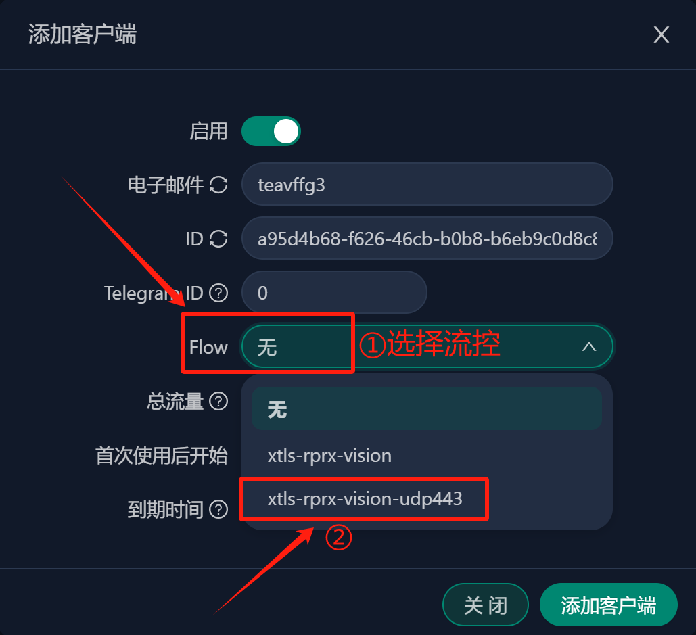

### 6.4 获取客户端配置

1. 在客户端列表中找到您创建的客户端
2. 点击QR码图标可以显示二维码
3. 点击复制按钮可以复制链接
4. 点击客户端，可以查看详细信息

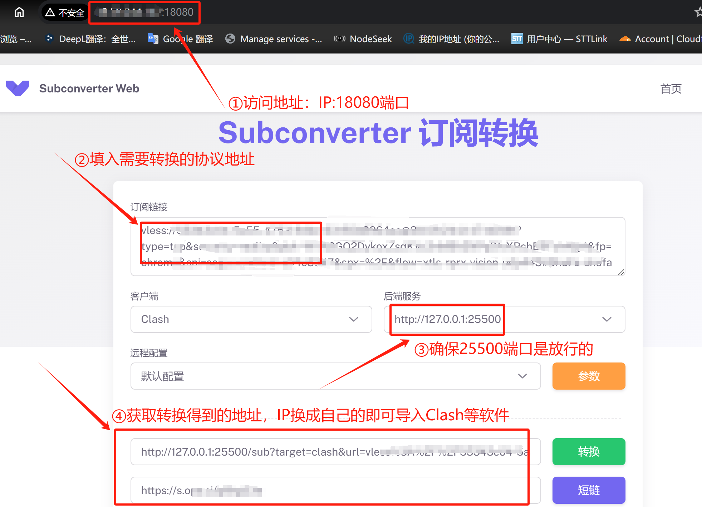

## 第七部分：客户端配置

### 7.1 安卓客户端

#### v2rayNG
- **推荐指数**：★★★★★
- **简介**：安卓平台最受欢迎的代理客户端之一，轻量，易用
- **支持协议**：VMess、VLESS、Trojan、Shadowsocks、REALITY等
- **下载地址**：
  - [GitHub Release](https://github.com/2dust/v2rayNG/releases)
  - [Google Play](https://play.google.com/store/apps/details?id=com.v2ray.ang)

#### Clash Meta for Android
- **推荐指数**：★★★★☆
- **简介**：Clash核心的安卓客户端，支持规则分流
- **支持协议**：VMess、VLESS、Trojan、Shadowsocks等
- **下载地址**：
  - [GitHub Release](https://github.com/MetaCubeX/ClashMetaForAndroid/releases)

### 7.2 iOS客户端

#### Shadowrocket
- **推荐指数**：★★★★★
- **简介**：iOS上最受欢迎的代理客户端，小火箭
- **支持协议**：VMess、VLESS、Trojan、Shadowsocks、REALITY等
- **下载地址**：
  - [App Store](https://apps.apple.com/us/app/shadowrocket/id932747118) (付费)

#### Stash
- **推荐指数**：★★★★☆
- **简介**：iOS上的Clash客户端，支持规则分流
- **支持协议**：VMess、VLESS、Trojan、Shadowsocks等
- **下载地址**：
  - [App Store](https://apps.apple.com/us/app/stash-proxy-utility/id1596063349) (付费)

### 7.3 Windows客户端

#### v2rayN
- **推荐指数**：★★★★★
- **简介**：Windows平台最受欢迎的代理客户端，功能丰富
- **支持协议**：VMess、VLESS、Trojan、Shadowsocks、REALITY等
- **下载地址**：
  - [GitHub Release](https://github.com/2dust/v2rayN/releases)

#### Clash Verge
- **推荐指数**：★★★★★
- **简介**：基于Clash内核的新一代跨平台代理客户端
- **支持协议**：VMess、VLESS、Trojan、Shadowsocks等
- **下载地址**：
  - [GitHub Release](https://github.com/zzzgydi/clash-verge/releases)

### 7.4 macOS客户端

#### ClashX Pro
- **推荐指数**：★★★★☆
- **简介**：macOS上的Clash客户端，简单易用
- **支持协议**：VMess、Trojan、Shadowsocks等
- **下载地址**：
  - [GitHub Release](https://github.com/yichengchen/clashX/releases)

#### V2RayU
- **推荐指数**：★★★★☆
- **简介**：macOS上的V2Ray客户端
- **支持协议**：VMess、VLESS、Trojan、Shadowsocks等
- **下载地址**：
  - [GitHub Release](https://github.com/yanue/V2rayU/releases)

### 7.5 Linux客户端

#### v2rayA
- **推荐指数**：★★★★★
- **简介**：Linux平台上的V2Ray客户端，支持网页管理
- **支持协议**：VMess、VLESS、Trojan、Shadowsocks等
- **下载地址**：
  - [GitHub Release](https://github.com/v2rayA/v2rayA/releases)

#### Clash for Windows
- **推荐指数**：★★★★☆
- **简介**：虽然名为Windows，但也支持Linux
- **支持协议**：VMess、VLESS、Trojan、Shadowsocks等
- **下载地址**：
  - [GitHub Release](https://github.com/Fndroid/clash_for_windows_pkg/releases)

### 7.6 导入配置方法

1. **直接导入链接**：复制3X-UI面板生成的链接，在客户端中选择"从剪贴板导入"
2. **扫码导入**：使用客户端扫描3X-UI面板生成的二维码
3. **订阅导入**：如果您的服务提供了订阅链接，可以在客户端中添加订阅

## 常见问题解答

### 3X-UI面板问题

#### Q1: 3X-UI面板无法通过域名访问？
**A**: 检查以下几点:
1. 确认域名已正确解析到服务器IP
2. 确认面板端口已放行
3. 检查反向代理配置是否正确
4. 确认SSL证书已正确申请并启用

#### Q2: 面板显示"连接不安全"？
**A**: 可能的原因:
1. SSL证书未正确配置
2. 使用了自签名证书
3. 宝塔面板未开启强制HTTPS

解决方法:
1. 确认证书已正确安装
2. 确保已开启"强制HTTPS"
3. 检查证书是否有效

#### Q3: 配置了REALITY但客户端连接失败？
**A**: 检查以下几点:
1. 确认客户端支持REALITY协议
2. 核对私钥、公钥配置
3. 检查端口是否已放行
4. 检查客户端版本是否支持您配置的选项

### 宝塔面板问题

#### Q1: 宝塔面板无法访问（白屏或404错误）

**可能原因:**
1. 服务器防火墙未放行8888端口
2. 宝塔面板服务未正常启动
3. 服务器内存不足

**解决方案:**
1. 检查并放行8888端口：
   ```bash
   ufw allow 8888/tcp  # Ubuntu/Debian
   firewall-cmd --permanent --zone=public --add-port=8888/tcp && firewall-cmd --reload  # CentOS
   ```

2. 重启宝塔面板：
   ```bash
   /etc/init.d/bt restart
   ```

#### Q2: 宝塔面板SSL证书申请失败

**可能原因:**
1. 域名解析未生效
2. 80端口被占用
3. DNS验证失败

**解决方案:**
1. 检查域名解析是否生效：
   ```bash
   ping 您的域名
   nslookup 您的域名
   ```

2. 检查80端口是否被占用：
   ```bash
   netstat -tlnp | grep :80
   ```

3. 尝试使用DNS验证方式：
   - 在申请证书时选择"DNS"验证方式
   - 按照提示添加TXT记录到域名解析

#### Q3: 通过宝塔反向代理后无法访问3X-UI面板

**可能原因:**
1. 3X-UI面板未正常运行
2. 反向代理配置不正确
3. WebSocket支持未配置

**解决方案:**
1. 检查3X-UI面板状态：
   ```bash
   x-ui status
   ```

2. 修复反向代理配置，确保包含以下配置：
   ```nginx
   proxy_set_header X-Forwarded-For $proxy_add_x_forwarded_for;
   proxy_set_header X-Forwarded-Proto $scheme;
   proxy_set_header X-Forwarded-Host $http_host;
   proxy_http_version 1.1;
   proxy_set_header Upgrade $http_upgrade;
   proxy_set_header Connection "upgrade";
   ```

## 性能优化

### 优化宝塔面板Nginx配置

1. 优化Nginx配置：
   ```nginx
   # 在nginx.conf中添加
   worker_processes auto;
   worker_rlimit_nofile 65535;
   events {
       worker_connections 65535;
       multi_accept on;
       use epoll;
   }
   ```

2. 启用Gzip压缩：
   ```nginx
   gzip on;
   gzip_min_length 1k;
   gzip_buffers 4 16k;
   gzip_http_version 1.1;
   gzip_comp_level 6;
   gzip_types text/plain application/javascript application/x-javascript text/css application/xml;
   gzip_vary on;
   ```

3. 启用浏览器缓存：
   ```nginx
   location ~* \.(jpg|jpeg|png|gif|ico|css|js)$ {
       expires 7d;
   }
   ```

### 限制3X-UI的资源使用

```bash
# 编辑systemd服务文件
nano /etc/systemd/system/x-ui.service

# 添加内存限制
[Service]
LimitNOFILE=1000000
LimitNPROC=512

# 重载服务
systemctl daemon-reload
systemctl restart x-ui
```

## 安全加固

### 3X-UI面板安全加固

1. 自定义面板路径和端口：
   - 在3X-UI面板中进入"面板设置"
   - 修改"面板路径"为随机字符串
   - 修改"面板端口"为非常规端口

2. 启用宝塔面板WAF功能：
   - 安装"网站防火墙"插件
   - 为反向代理的3X-UI站点启用WAF防护

3. 限制登录IP（通过宝塔Nginx配置）：
   ```nginx
   location /您的面板路径/ {
       allow 您的IP;
       deny all;
       # 其他代理配置...
   }
   ```

### 宝塔面板安全加固

1. 更改宝塔面板默认端口：
   ```bash
   bt
   # 选择"14"更改面板端口
   ```

2. 设置宝塔面板访问白名单：
   - 在面板左侧找到"安全"
   - 添加您的IP地址到白名单

## 维护与备份

### 数据备份

建议定期备份3X-UI数据库:
1. 在面板中配置"电报机器人"自动备份
2. 或通过面板的"面板设置"→"数据库备份"功能手动备份

### 数据文件路径

- 数据库路径：`/etc/x-ui/x-ui.db`
- 配置文件路径：`/usr/local/x-ui/bin/config.json`

### 3X-UI面板数据迁移

在服务器迁移时保留3X-UI数据：
1. 备份原服务器数据：
   ```bash
   # 备份3X-UI数据库
   cp /etc/x-ui/x-ui.db /root/x-ui.db.backup
   
   # 备份配置文件
   cp /usr/local/x-ui/bin/config.json /root/config.json.backup
   ```

2. 在新服务器上安装3X-UI
3. 停止新服务器上的3X-UI服务：
   ```bash
   x-ui stop
   ```

4. 上传备份文件到新服务器并恢复：
   ```bash
   # 恢复数据库
   cp /root/x-ui.db.backup /etc/x-ui/x-ui.db
   
   # 恢复配置
   cp /root/config.json.backup /usr/local/x-ui/bin/config.json
   
   # 重启服务
   x-ui restart
   ```

## 附录：Docker安装方式

### Docker安装3X-UI

1. **安装Docker**
   ```shell
   bash <(curl -sSL https://get.docker.com)
   ```

2. **克隆项目仓库**
   ```shell
   git clone https://github.com/xeefei/3x-ui.git
   cd 3x-ui
   ```

3. **启动服务**
   ```shell
   docker compose up -d
   ```
   
   或者使用Docker命令：
   ```shell
   docker run -itd \
      -e XRAY_VMESS_AEAD_FORCED=false \
      -v $PWD/db/:/etc/x-ui/ \
      -v $PWD/cert/:/root/cert/ \
      --network=host \
      --restart=unless-stopped \
      --name 3x-ui \
      ghcr.io/xeefei/3x-ui:latest
   ```

4. **更新至最新版本**
   ```shell
   cd 3x-ui
   docker compose down
   docker compose pull 3x-ui
   docker compose up -d
   ```

---

> **注意**：本教程中提到的所有截图位置，需要您在实际操作过程中进行截图并插入到相应位置。请在发布前确保截图内容不会泄露服务器IP、域名等敏感信息。 